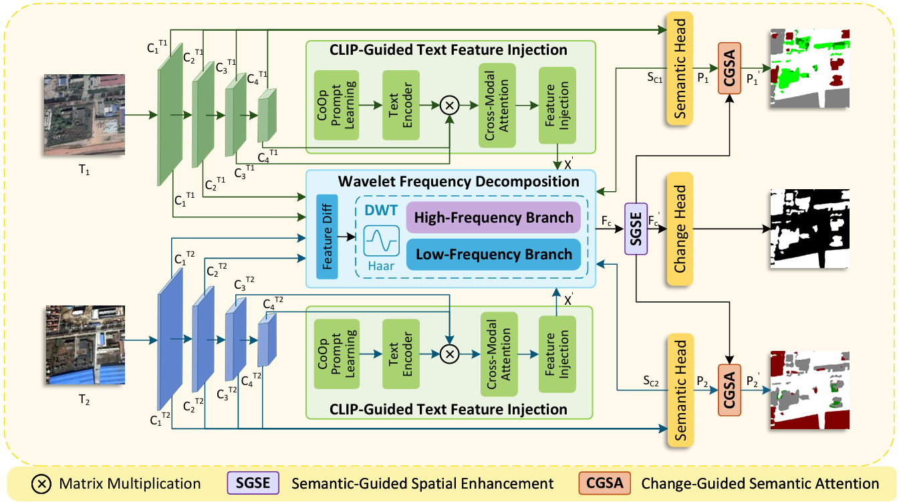

# TS-FDNet

This repository provides the code for the method in our paper '**Text-Semantics Guided Frequency-Decoupled Network for Semantic Change Detection**'. 

## Overview

<p align="center">
  
</p>

**TS-FDNet** is a multimodal, frequency-decoupled deep learning network tailored for remote sensing semantic change detection (SCD). By separating feature frequencies and injecting text-semantic priors, the network successfully suppresses global pseudo-changes and resolves category confusion under complex environmental variations.Specifically, bi-temporal images are first encoded into multi-scale visual features, which are enhanced at high decoder layers. The WFD module then decouples low-frequency global structures and high-frequency local details, which are modeled by Mamba and deformable convolutions, respectively. Finally, bidirectional change-semantic feedback jointly refines change localization and bi-temporal semantic predictions.


## Environment setup

TS-FDNet requires a CUDA-enabled GPU. The recorded environment uses
Python 3.10.19, PyTorch 2.6.0, and torchvision 0.21.0 with CUDA 12.4 builds.
Package versions are provided in [requirements.txt](requirements.txt).

Clone the repository and create the Python environment:

```bash
git clone https://github.com/SDUSTVIGroup/TSFDNet.git
cd TSFDNet

conda create -n tsfdnet python=3.10.19 -y
conda activate tsfdnet
```

Install PyTorch and torchvision:

```bash
python -m pip install torch==2.6.0 torchvision==0.21.0 torchaudio==2.6.0 --index-url https://download.pytorch.org/whl/cu124
```

Install the remaining dependencies, including OpenAI CLIP at the commit
specified in requirements.txt:

```bash
python -m pip install -r requirements.txt
python -m pip check
```

## Data preparation

Taking training the SECOND dataset as an example, split the SCD data into training, validation and testing (if available) set and organize them as follows:

>SECOND
>  - train
>    - im1
>    - im2
>    - label1
>    - label2
>  - val
>    - im1
>    - im2
>    - label1
>    - label2
>  - test
>    - im1
>    - im2
>    - label1
>    - label2
    
If the downloaded SECOND annotations are RGB color masks, either convert them to single-channel index masks before training or enable `Color2Index` in `datasets/RS_SECOND.py` for both `label1` and `label2`.

Set the dataset root in `datasets/RS_SECOND.py`:

```python
root = 'your dataset'
```


## Train

Download the pretrained weights from “Link: [Baidu Netdisk](https://pan.baidu.com/s/1t-Gu3oO1pqJggPxjVbSPfA?pwd=gypx) (extraction code: `gypx`) and place them under the repository's `pretrained/` directory:

```text
TSFDNet/
`-- pretrained/
    |-- backbone_weights.pth
    `-- RemoteCLIP-ViT-B-32.pt
```
Put `backbone_weights.pth` in line 49 of `train_TSFDNet.py`, like this:

```python
# In the existing args dictionary:
'load_path': "···/pretrained/backbone_weights.pth",
```

Place `RemoteCLIP-ViT-B-32.pt` at line 906 in `models/TSFDNet.py`, like this:

```python
clip_head_path='···/pretrained/RemoteCLIP-ViT-B-32.pt'
```

Select an available GPU near the top of `train_TSFDNet.py`, for example:

```python
os.environ['CUDA_VISIBLE_DEVICES'] = '0'
```

Run the command from the repository root:

```bash
python train_TSFDNet.py 
```

## Checkpoint

- **TS-FDNet checkpoint**：[Baidu Netdisk](https://pan.baidu.com/s/1sW-WgOfNvPb3HVh4LSOtwA?pwd=rprp) (extraction code: `rprp`)

## Inference

Put the test-set path in line 26 of `inference.py`, like this:

```python
parser.add_argument('--test_dir', default='.../SECOND/test')
```

Put the downloaded checkpoint path in line 27 of `inference.py`, like this:

```python
parser.add_argument('--chkpt_path', default='.../checkpoints/best.pth')
```

Run inference from the repository root:

```bash
python inference.py
```

## Results

<p align="center">
  
</p>


<p align="center">
  
</p>


## Acknowledgement
